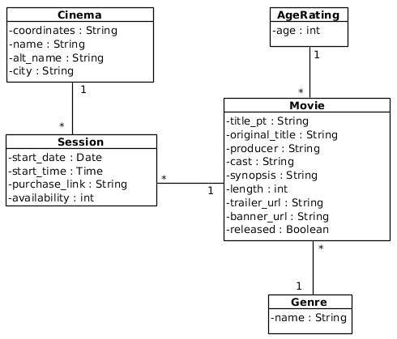

# Cinemas Webscrapper

## Table of Contents
* [What is it?](#what-is-it)
  - [Features](#features)
* [Usage](#usage)
  - [Development setup](#development-setup)
  - [Deployment](#deployment)
* [Architecture](#architecture)
  - [Database ER diagram](#database-er-diagram)
  - [API](#api)

## What is it?
Cinemas webscrapper is scrapper developed with the aim of retrieving information related
to cinemas, movies and sessions regarding Cinemas NOS. It integrates a chat bot developed
with the aim of improving the customer assistance provided by ISPs, NOS in this case, by
aggregating most of their customer services in a single endpoint.

### Features
The API provided by this service allows:
* Retrieve list of sessions based on current date and location
* Retrieve next movies based on location
* Get movie suggestions based on duration
* Search for movies based on:
    * Genre
    * Producer
    * Cast
    * Synopsis
    * Age restriction
* Retrieve of upcoming releases
* Retrieve movie details
* Retrieve next sessions based on movie, date, location


## Usage
### Development Setup
* Install *Django* dependencies:
`pip install -r requirements.txt --user`
* Install *Docker*
* Pull *Redis* container:
`docker pull redis`
* Create & migrate DB
```
./manage.py makemigrations
./manage.py migrate
```
* Import static data:
`./manage.py loaddata static/cinemas_fixture.json`
* Run *Django* project:
`./manage.py runserver`
* Run *Redis* back-end
`docker run -p 6379:6379 redis`
* Run *Celery* (for periodic database update):
`celery -A cinemas_scrapper.celery worker -B -l INFO`

### Deployment
* Build Docker image
`docker build -t cinemas_scrapper .`
* Run Docker container
`docker run -p 5003:8000 -it cinemas_scrapper`
* Change directory
`cd Cinemas_Webscrapper`
* Run script
`./run.sh`


## Architecture
### Database ER diagram


### API
<details>
<summary>Search for cinemas or get the closest ones</summary>

```http
GET /scrapper/cinemas/search?search_term=<>&lat=<>&lon=<>
```

| Parameter | Type | Description |
| :--- | :--- | :--- |
| `search_term` | `string` | **Optional***. Cinema query. |
| `lat` and `lon` | `float` | **Optional***. User location. |


**Note**: When values are given to `lat` and `lon` the returned cinemas are in a maximum distance of 20 km.

📄 **Example of use**
```http
GET /scrapper/cinemas/search?search_term=Algarve
```

```json
{
    "cinemas": [
        "Forum Algarve",
        "Mar Shopping Algarve"
    ]
}
```
------
</details>

<!---------------------------------------------------->

<details>
<summary>Search for movies in cinema</summary>

```http
GET /scrapper/movies/by_cinema?search_term=<>&lat=<>&lon=<>
```

| Parameter | Type | Description |
| :--- | :--- | :--- |
| `search_term` | `string` | **Optional***. Cinema query. |
| `lat` and `lon` | `float` | **Optional***. User location. |

📄 **Example of use**
```http
GET /scrapper/movies/by_cinema?search_term=Algarve
```

```json
{
    "Forum Algarve": [
        {
            "Portuguese title": "A Bela Adormecida 19/20",
            "IMDB Rating": "N/A"
        },
        {
            "Portuguese title": "A Ovelha Choné - O Filme: A Quinta Contra-Ataca",
            "IMDB Rating": "7.1"
        },
        {
            "Portuguese title": "O Caso de Richard Jewell",
            "IMDB Rating": "7.7"
        },
        ...
    ],
    "Mar Shopping Algarve": [
        {
            "Portuguese title": "A Bela Adormecida 19/20",
            "IMDB Rating": "N/A"
        },
        {
            "Portuguese title": "Line of Duty: O Resgate",
            "IMDB Rating": "5.1"
        },
        {
            "Portuguese title": "The Grudge: Maldição",
            "IMDB Rating": "N/A"
        },
        ...
    ]
}
```
------
</details>

<!---------------------------------------------------->

<details>
<summary>Search for movies based on genre, producer, cast, synopsis and age restriction</summary>

```http
GET /scrapper/movies/search?genre=<>&cast=<>&producer=<>&synopsis=<>&age=<>
```

| Parameter | Type | Description |
| :--- | :--- | :--- |
| `genre` | `string` | **Optional**. Movie genre. |
| `cast` | `string` | **Optional**. Actors names, comma separated. |
| `producer` | `string` | **Optional**. Producer name. |
| `synopsis` | `string` | **Optional**. Words to search on the movie synopsis, comma separated. |
| `age` | `int` | **Optional**. Maximum age restriction. |

**Note**: All parameters are optional but at least one of them needs to be provided.

📄 **Example of use**
```http
GET /scrapper/movies/search?cast=Kevin Hart,Dwayne Johnson
```

```json
[
  {
    "Original title": "Jumanji: The Next Level",
    "Cast": "Dwayne Johnson, Jack Black, Kevin Hart",
    "Genre": "Aventura",
    "Banner": "http://cinemas.nos.pt/_layouts/15/Handlers/RenderImage.ashx?file=52285.jpg",
    "Trailer": "https://youtube.com/embed/yx9u6IsJrxM",
    "Producer": "Jake Kasdan",
    "IMDB Rating": "7.0",
    "Synopsis": "O gangue está de volta, mas o jogo mudou. Quando regressam a Jumanji para resgatar um deles, descobrem que nada é como estavam à espera. Os jogadores terão de enfrentar lugares desconhecidos e inexplorados, desde os áridos desertos às montanhas nevadas, para escapar do jogo mais perigoso do mundo.",
    "Length (min)": 120,
    "Released": true,
    "Portuguese title": "Jumanji: O Nível Seguinte",
    "Age rating": 12
  }
]
```
------
</details>

<!---------------------------------------------------->
<details>
<summary>Search for upcoming movies</summary>

```http
GET /scrapper/movies/releases
```

📄 **Example of response**

```json
[
  {
    "Original title": "Dark Waters",
    "Cast": "Mark Ruffalo, Anne Hathaway, William Jackson Harper",
    "Genre": "Drama",
    "Banner": "http://cinemas.nos.pt/_layouts/15/Handlers/RenderImage.ashx?file=52277.jpg",
    "Trailer": "https://youtube.com/embed/pGcCvkaC8nc",
    "Producer": "Todd Haynes",
    "IMDB Rating": "7.3"
  },
  {
    "Original title": "Mulan",
    "Cast": "Yifei Liu, Donnie Yen, Jason Scott Lee",
    "Genre": "Aventura",
    "Banner": "http://cinemas.nos.pt/_layouts/15/Handlers/RenderImage.ashx?file=52278.jpg",
    "Trailer": "https://youtube.com/embed/64say-fnG2Y",
    "Producer": "Niki Caro",
    "IMDB Rating": "N/A"
  },
  {
    "Original title": "No Time To Die",
    "Cast": "Daniel Craig, Léa Seydoux, Rami Malek",
    "Genre": "Ação",
    "Banner": "http://cinemas.nos.pt/_layouts/15/Handlers/RenderImage.ashx?file=52279.jpg",
    "Trailer": "https://youtube.com/embed/o0-kWBe-Kto",
    "Producer": "Cary Joji Fukunaga",
    "IMDB Rating": "N/A"
  }
]
```
------

</details>

<!---------------------------------------------------->

<details>
<summary>Get details of movie</summary>

```http
GET /scrapper/movies/details?movie=<>
```

| Parameter | Type | Description |
| :--- | :--- | :--- |
| `movie` | `string` | **Required**. Name of the movie. |

📄 **Example of use**
```http
GET /scrapper/movies/details?movie=Joker
```

```json
[
    {
        "Original title": "Joker",
        "Cast": "Joaquin Phoenix, Robert De Niro, Zazie Beetz",
        "Genre": "Thriller",
        "Banner": "http://cinemas.nos.pt/_layouts/15/Handlers/RenderImage.ashx?file=52161.jpg",
        "Trailer": "https://youtube.com/embed/rje8OUw45UQ",
        "Producer": "Todd Phillips",
        "IMDB Rating": "8.7",
        "Synopsis": "Arthur Fleck é um homem que enfrenta a crueldade e o desprezo da sociedade, juntamente com a indiferença de um sistema que lhe permite passar da vulnerabilidade para a depravação. Durante o dia é um palhaço e à noite luta para se tornar um artista de stand-up comedy…mas descobre que é ele próprio a piada. Sempre diferente de todos em seu redor, o seu riso incontrolável e inapropriado, ganha ainda mais força quando tenta contê-lo, expondo-o a situações ridículas e até à violência. Preso numa existência cíclica que oscila entre o precipício da realidade e da loucura, uma má decisão acarreta uma reacção em cadeia de eventos crescentes e, por fim, mortais.",
        "Length (min)": 122,
        "Released": true,
        "Portuguese title": "Joker",
        "Age rating": 14
    }
]
```
------
</details>

<!---------------------------------------------------->

<details>
<summary>Search for sessions of movies under a certain duration</summary>

```http
GET /scrapper/sessions/by_duration?search_term=<>&lat=<>&lon=<>&duration=<>&date=<>&start_time=<>&end_time=<>
```

| Parameter | Type | Description |
| :--- | :--- | :--- |
| `search_term` | `string` | **Optional***. Cinema query. |
| `lat` and `lon` | `float` | **Optional***. User location. |
| `duration` | `int` | **Required**. Maximum value of duration (in minutes). |
| `date` | `Year-Month-Day` | **Optional**. Date. |
| `start_time` | `Hours:Minutes:Seconds` | **Optional**. Lower time limit for the beginning of the sessions. |
| `end_time` | `Hours:Minutes:Seconds` | **Optional**. Upper time limit for the beginning of the sessions. |

📄 **Example of use**
```http
GET /scrapper/sessions/by_duration?search_term=Braga&duration=130&date=2019-12-11&start_time=15:00:00&end_time=15:50:00
```

```json
{
    "Braga Parque": [
        {
            "Availability": "184",
            "Start time": "15h00",
            "Movie": "Joker",
            "Start date": "11/12/2019",
            "Ticket link": "https://bilheteira.cinemas.nos.pt/webticket/bilhete.jsp?CinemaId=WA&CodFilme=1983870&DataSessao=2019-12-11&HoraSessao=15:00&Sala=5",
            "Length (min)": 122
        },
        {
            "Availability": "160",
            "Start time": "15h40",
            "Movie": "Charlie’s Angels",
            "Start date": "11/12/2019",
            "Ticket link": "https://bilheteira.cinemas.nos.pt/webticket/bilhete.jsp?CinemaId=WA&CodFilme=1000335&DataSessao=2019-12-11&HoraSessao=15:40&Sala=2",
            "Length (min)": 120
        },
        {
            "Availability": "216",
            "Start time": "15h50",
            "Movie": "The Aeronauts",
            "Start date": "11/12/2019",
            "Ticket link": "https://bilheteira.cinemas.nos.pt/webticket/bilhete.jsp?CinemaId=WA&CodFilme=1728200&DataSessao=2019-12-11&HoraSessao=15:50&Sala=6",
            "Length (min)": 100
        }
    ]
}
```
------
</details>

<!---------------------------------------------------->

<details>
<summary>Search for the next sessions</summary>

```http
GET /scrapper/sessions/next_sessions?search_term=<>&lat=<>&lon=<>
```

| Parameter | Type | Description |
| :--- | :--- | :--- |
| `search_term` | `string` | **Optional***. Cinema query. |
| `lat` and `lon` | `float` | **Optional***. User location. |

📄 **Example of use**
```http
GET /scrapper/sessions/next_sessions?search_term=Braga
```

```json
{
    "Braga Parque": [
        {
            "Start date": "11/12/2019",
            "Start time": "23h50",
            "Movie": "Frozen II",
            "Ticket link": "https://bilheteira.cinemas.nos.pt/webticket/bilhete.jsp?CinemaId=WA&CodFilme=1733660&DataSessao=2019-12-11&HoraSessao=23:50&Sala=3",
            "Availability": "324"
        },
        {
            "Start date": "11/12/2019",
            "Start time": "23h50",
            "Movie": "Knives Out",
            "Ticket link": "https://bilheteira.cinemas.nos.pt/webticket/bilhete.jsp?CinemaId=WA&CodFilme=1000338&DataSessao=2019-12-11&HoraSessao=23:50&Sala=7",
            "Availability": "174"
        },
        {
            "Start date": "11/12/2019",
            "Start time": "00h05",
            "Movie": "The Aeronauts",
            "Ticket link": "https://bilheteira.cinemas.nos.pt/webticket/bilhete.jsp?CinemaId=WA&CodFilme=1728200&DataSessao=2019-12-12&HoraSessao=00:05&Sala=6",
            "Availability": "216"
        }
    ]
}
```
------
</details>

<!---------------------------------------------------->

<details>
<summary>Search sessions for a given movie</summary>

```http
GET /scrapper/sessions/by_movie?search_term=<>&lat=<>&lon=<>&movie=<>&date=<>&start_time=<>&end_time=<>
```

| Parameter | Type | Description |
| :--- | :--- | :--- |
| `search_term` | `string` | **Optional***. Cinema query. |
| `lat` and `lon` | `float` | **Optional***. User location. |
| `movie` | `string` | **Required**. Name of the movie. |
| `date` | `Year-Month-Day` | **Optional**. Date. |
| `start_time` | `Hours:Minutes:Seconds` | **Optional**. Lower time limit for the beginning of the sessions. |
| `end_time` | `Hours:Minutes:Seconds` | **Optional**. Upper time limit for the beginning of the sessions. |

📄 **Example of use**
```http
GET /scrapper/sessions/by_movie?search_term=Braga&movie=Joker&date=2019-12-11&start_time=17:00:00&end_time=22:00:00
```

```json
{
    "Braga Parque": {
        "Joker": {
            "sessions": [
                {
                    "Start time": "18h00",
                    "Availability": "184",
                    "Ticket link": "https://bilheteira.cinemas.nos.pt/webticket/bilhete.jsp?CinemaId=WA&CodFilme=1983870&DataSessao=2019-12-11&HoraSessao=18:00&Sala=5",
                    "Start date": "11/12/2019"
                },
                {
                    "Start time": "21h00",
                    "Availability": "184",
                    "Ticket link": "https://bilheteira.cinemas.nos.pt/webticket/bilhete.jsp?CinemaId=WA&CodFilme=1983870&DataSessao=2019-12-11&HoraSessao=21:00&Sala=5",
                    "Start date": "11/12/2019"
                }
            ]
        }
    }
}
```
------
</details>

<!---------------------------------------------------->

<details>
<summary>Search for sessions by date</summary>

```http
GET /scrapper/sessions/by_date?search_term=<>&lat=<>&lon=<>&date=<>&start_time=<>&end_time=<>
```

| Parameter | Type | Description |
| :--- | :--- | :--- |
| `search_term` | `string` | **Optional***. Cinema query. |
| `lat` and `lon` | `float` | **Optional***. User location. |
| `date` | `Year-Month-Day` | **Optional**. Date. |
| `start_time` | `Hours:Minutes:Seconds` | **Optional**. Lower time limit for the beginning of the sessions. |
| `end_time` | `Hours:Minutes:Seconds` | **Optional**. Upper time limit for the beginning of the sessions. |

📄 **Example of use**
```http
GET /scrapper/sessions/by_date?search_term=Braga&date=2019-12-11&start_time=16:00:00&end_time=16:25:00
```

```json
{
    "Braga Parque": [
        {
            "Start time": "16h00",
            "Availability": "324",
            "Ticket link": "https://bilheteira.cinemas.nos.pt/webticket/bilhete.jsp?CinemaId=WA&CodFilme=1984110&DataSessao=2019-12-11&HoraSessao=16:00&Sala=3",
            "Movie": "Frozen II",
            "Start date": "11/12/2019"
        },
        {
            "Start time": "16h10",
            "Availability": "177",
            "Ticket link": "https://bilheteira.cinemas.nos.pt/webticket/bilhete.jsp?CinemaId=WA&CodFilme=1000350&DataSessao=2019-12-11&HoraSessao=16:10&Sala=4",
            "Movie": "Qu'est-ce qu'on a encore fait au Bon Dieu?",
            "Start date": "11/12/2019"
        },
        {
            "Start time": "16h20",
            "Availability": "107",
            "Ticket link": "https://bilheteira.cinemas.nos.pt/webticket/bilhete.jsp?CinemaId=WA&CodFilme=1000351&DataSessao=2019-12-11&HoraSessao=16:20&Sala=1",
            "Movie": "Bikes",
            "Start date": "11/12/2019"
        }
    ]
}
```
------
</details>

<br/>

***Note**: The methods related to sessions require `search_term` or in alternative `lat` and `lon`, so that the desired or closest cinemas can be obtained.
